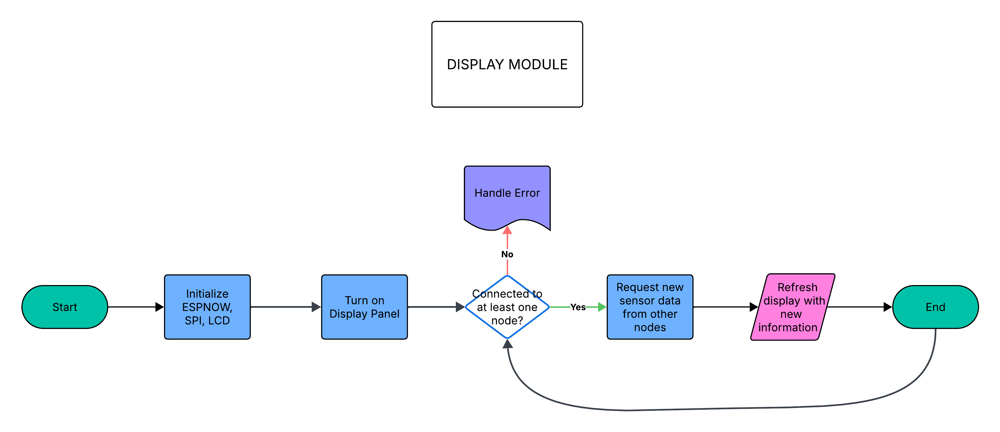
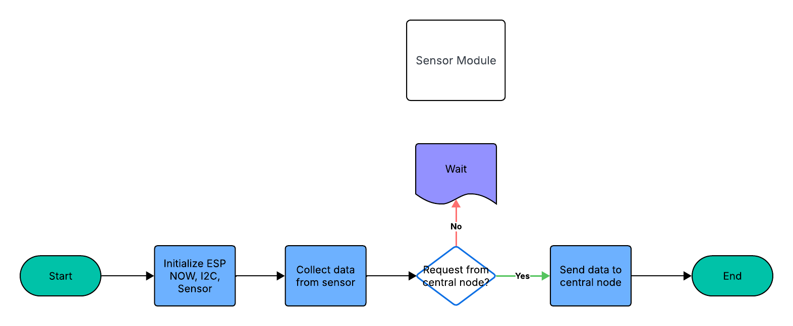

# Status
- I am actively working on this project
- Deadline 2026-06-01

# Project Overview
This project uses the ESP NOW protocol. Using multiple ESP32 modules, with one at the central, it requests temperature and humidity sensor data from the other nodes and display it onto the screen.

---

# Why?
My father was recently diagnosed with Gastroesophageal Reflux Disease (GERD). Because of this, he experiences chronic coughing, which becomes worse in dry air. To help monitor the environment around him, I created this sensor system to track temperature and humidity levels throughout the house. I do this in the hope that it will help better his health.

---

# Flow Charts

     
    <em>Central Node Flow Chart</em>

     
    <em>Sensor Node Flow Chart</em>

## Development Log
### 2026-05-17
The following needed to be tested since the information was not given by manufacurer:
- Set up display with LCD protocol
- Tested driver
- Tested LCD colour order configuration (RGB/BGR)
- Tested display inversion settings (inverted vs non-inverted colours)
- Tested display orientation and mirroring configuration
- Tested display 

    
    
    

### 2026-05-18
- Set up LVGL
- Created a simple LVGL UI for testing
- Moved initializations and setups to components directories
- Did research on how to implement touch functionality and failed, mostly due to incorrect driver documentation from manufacturer
- Designed GUI with place holder for future implementations

    

# References
Accessed 2026-05-16
https://www.tztstore.com/goods/show-7983.html
https://docs.espressif.com/projects/esp-idf/en/stable/esp32/api-reference/peripherals/lcd/index.html
https://github.com/lvgl/lvgl

Accessed 2026-05-18
https://github.com/kodediy/esp_lcd_touch_cst820
